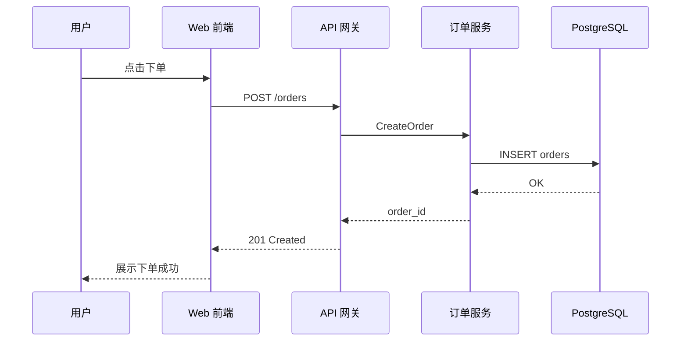

# 图表手册：用图回答问题（⑦ 图表产出的完整方法论）

> **颗粒度声明**：本手册界定的是**颗粒度下限**，不是照抄的模板——每张图必须能回答一个明确问题、必须登记过期信号与生成命令、依赖图必须脚本生成，这些是硬约束；图的布局、切分与呈现形式可自由组织。

> **图内可读性**：图中节点与边标签**不得使用未解释的代号、缩写、自造词**；缩写首现处括注全称——图是给人看的，不是密码本（执行纪律第 8 锁）。

> 看懂一个项目的关键，不是"画多少种图"，而是**用图去回答别人（和三个月后的你自己）会问的几个问题**。
> 本手册是 SKILL.md ⑦ 图表产出步的完整指导：选图、画图、维护、挂流程。

## 核心思想

图的头号敌人是过期——一张过期的架构图比没有图更害人。因此：能自动生成的绝不手画；手画的必须登记"过期信号"；每张图都必须能回答一个明确的问题，回答不了任何问题的图不画。

## ① 项目的"名片"：容器图（系统架构图）

这张图回答的是最根本的问题——**"这系统由哪几块组成、块与块之间怎么调"**。新人拿到项目、评审一个方案、对外介绍时，第一眼看的就是它。它应放在 README 顶部，是整套图表里唯一"必须存在"的一张。

## ② 按"问题"选图：速查表

| 你想回答的问题 | 对应的图 | 一句话说明 |
|---|---|---|
| 系统由哪几块组成、怎么互相调？ | 容器图 / 系统架构图 | 项目的"地图"，最优先画 |
| 代码内部模块怎么依赖？ | 模块依赖图 | 从代码自动生成，看耦合和分层 |
| 一个请求从进来到返回，走了一遍什么路？ | 时序图 | 排查线上问题、理清调用链的神器 |
| 业务流程有哪几个分支、谁审批？ | 流程图 / 泳道图 | 描述"人+系统"参与的复杂流程 |
| 某个对象（订单、工单）有哪些状态？ | 状态机图 | 状态一多，没有它必出 bug |
| 数据存在哪、表和表什么关系？ | ER 图（实体关系图） | 后端和 DBA 的通用语言 |
| 服务部署在哪、流量怎么进来？ | 部署图 / 网络拓扑 | 出事故时救命 |
| 从提交代码到上线，经过哪些关卡？ | CI/CD 流水线图 | 提交→门禁→构建→发布的全关卡视图 |
| （进阶）类之间怎么继承组合？ | UML 类图 | 面向对象设计阶段 |
| 哪段代码/函数最耗时？ | 火焰图 / 热点图 | 性能分析视角；**④ 性能剖面实跑后必画**（flameprof→SVG 或 matplotlib 热点图），不可运行项目登记豁免 + 给采集命令 |

**诚实条款**：运行时视图必须有真实 profile 数据。④ 已实跑性能剖面 → 火焰图/热点图**必画且必进图集**（同源于 `.pstats`）；项目不可运行 → 登记"无法剖面"豁免 + 给采集命令（`cProfile` / `pyinstrument` / `speedscope`），**绝不凭印象编造火焰图**——与本技能 ⑥ 反幻觉原则同源。

## ③ 维护策略：四原则

**原则一：分层维护，不同层不同频率（C4 模型的思路）**

- 上下文图（系统边界、外部用户）：半年到一年才变一次，手画
- 容器图（服务拆分）：架构变更时才动，手画
- 组件/依赖图（代码内部）：**永远自动生成，不手画**

**原则二：图即代码（Diagram as Code）**

用 Mermaid/PlantUML 把图写成文本放进仓库，好处巨大：

- GitHub/GitLab 原生渲染，README 里直接显示
- PR 里可以像代码一样 diff，改了什么一目了然
- 不依赖任何外部工具，十年后还能打开

**原则三：能自动生成的绝不手画**

| 图 | 自动生成工具 |
|---|---|
| 依赖图 | Python: pydeps；JS/TS: madge、dependency-cruiser；Go: go mod graph；**或直接用本技能 ② 产出的依赖边列表（dep-edges.json）自写生成器（见 §⑥ 对接）** |
| ER 图 | schemaspy、prisma generate、DBeaver 逆向工程、dbdiagram.io |
| API 图 | Swagger/OpenAPI 文件本身就是图源 |
| CI/CD | 工作流可视化页面（GitHub Actions 自带） |

**原则四：把图挂进开发流程**

- README 顶部放容器图 + 核心链路时序图
- PR 模板加一项 checklist："本次改动是否影响架构图/ER 图？改了就一起提交"
- 重大架构变更配一篇 ADR（架构决策记录），记下"为什么这么改"

## ④ 最小起步组合（4 张图就够）

1. 一张容器图（README 顶部）
2. 一张核心业务链路的时序图（比如"一次下单"）
3. 一张 ER 图（半自动生成）
4. 一张自动生成的依赖图（CI 里跑）

这四张覆盖了 80% 的"让人看懂项目"场景，维护成本也最低。其余图按读者问题按需增补，不凑数。

## ⑤ 可直接复制的 Mermaid 时序图示例

放进 README.md 就能被 GitHub 渲染：

## ⑤b 模块级图集（下探到哪，画到哪）

全局图集回答"整个系统长什么样"，模块级图集回答"**这个模块内部**长什么样"——③ 分层下钻的每个代码模块一套四类，落 `7-diagrams/modules/<模块slug>/`：

| 图 | 回答的问题 | 数据来源 | 生成方式 |
|---|---|---|---|
| 模块架构图 | 模块内部由哪些构件组成、各管什么 | ③ 模块卡 + symbols.json 符号表 | 半自动/手画 |
| 模块依赖图 | 模块内文件级依赖与对外边界 | ② dep-edges.json 按模块过滤 | **脚本自动生成，禁止手画** |
| 模块时序图 | 该模块最典型的一条链路 | 代码实测（file:line） | 手画，过 ⑥ 核对 |
| 模块 ER 图 | 该模块的数据结构与关系 | schema.sql / CSV 表头 / 数据类定义 | 半自动；**无数据面登记"无数据面豁免"** |

心跳按图计（"完成 m/总图数"）；四类中确实不适用的类型必须显式登记豁免理由，不得静默缺图。

## ⑥ 与本技能前六步产物的对接（图表的数据从哪来）

⑦ 不是从零画图——前六步的产物就是图表的数据源，且**能自动生成的必须从这些产物自动生成**：

| 图 | 数据来源（前六步产物 / 代码位置） | 生成方式 |
|---|---|---|
| 容器图 | ① AGENTS.md 目录职责 + ④ architecture.md 分层图 | 手画（架构变更时才动），Mermaid 源码入仓库 |
| 模块依赖图 | ② dep-edges.json（符号依赖边列表） | **自动生成**：写生成器脚本从边列表聚合模块级图，输出 mermaid；支持 `--check` 比对防过期（呼应"依赖图只准重新生成"纪律） |
| 核心链路时序图 | ④ architecture.md 数据流节 + 代码实测（file:line） | 手画，画完按 ⑥ facts 核对每条消息 |
| 流程/泳道图 | 仓库的走闸/审批流程文档（如 hooks、门件） | 手画 |
| 状态机图 | 状态机代码（如 lifecycle 的状态常量与迁移函数） | 手画，迁移边逐一对照代码 |
| ER 图 | schema 文件（schema.sql / CSV 表头） | 半自动：表结构照抄 schema，关系手标 |
| 部署图 | 装配器产物形态 + 部署文档 | 手画 |
| CI/CD 流水线图 | hooks/CI 配置文件 | 手画（或 CI 平台自带可视化截图链接） |
| UML 类图 | ③ symbols.json（全库符号表，含继承关系可由 ast 获取） | 半自动 |
| 火焰图/热点图 | ④ perf-report 与 `.pstats` 原始数据 | **同源自动生成**：flameprof→SVG 或 matplotlib 热点图；豁免须登记 |

## ⑦ archify 联动（交互式 HTML 大图，可选）

需要对外交付可点击、可探索的图时，用 archify 把同一份拓扑渲染成交互 HTML（图即代码的另一形态，源 JSON 同样入仓库）：

| mermaid 图 | archify 类型 | 说明 |
|---|---|---|
| 容器图 | `architecture` | 组件/边界/卡片，showcase 质量门含真实浏览器校验 |
| CI/CD 流水线图 / 泳道图 | `workflow` | lanes 即泳道，门禁即 security 节点 |
| 时序图 | `sequence` | participants/messages/activations |
| 状态机图 | `lifecycle` | 状态与迁移保留语义 |

规则：mermaid 源码是**事实源**，archify JSON 从它转译；两者不一致时以代码核对结果为准（回 ⑥）。
